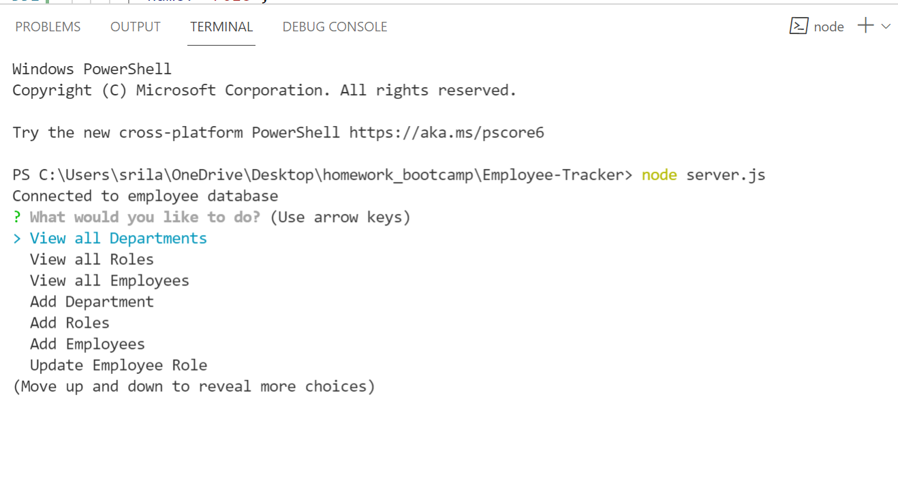
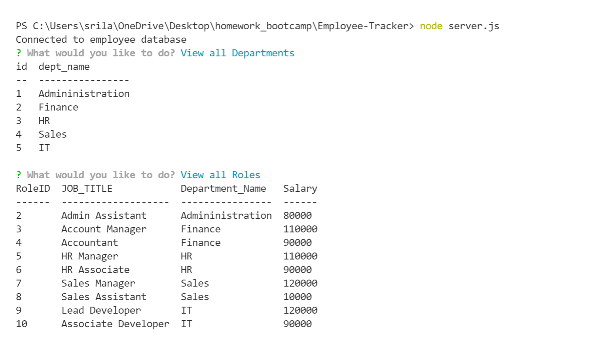

# Employee-Tracker

## Description

- Employee-Tracker is a command-line application to manage a company's employee database, using Node.js, Inquirer, and MySQL.

## Table Of Contents

- [Description](#Description)
- [Installation](#Installation)
- [Usage](#Usage)
- [Tests](#Tests)
- [Contributing](#Contributing)
- [Assets](#Assets)
- [Demo](#Demo)

## Installation

- You will need Node.js installed on your local machine

- Clone the repository to your local development environment.

* git clone https://github.com/SrilalithaN/Employee-Tracker

* Run npm install to install all dependencies.

- I created the Employee Management System with npm packages: MySQL, Node, Inquirer, and console.table.

* To use the application locally, run node server.js in your CLI, and then answer the prompts to view all the functionalities.

## Usage

Application tree structure: The application is user friendly and built to handle large amount of data (ie: what if the company have about 10,000 employees and 1,000+ roles)

- View all Departments - On selecting this prompt it prints all departments in a table.

- View all Roles - On selecting this prompt it prints the department name, job/role title, salary in a table.

- View All Employees - On selecting this prompt it prints all employees in a table. Table contains employee id, employee name, title, department, salary and employee manager.

- Add An Employee - On selecting this it allows to add a new employee to the database by answering few prompts.

- Add a department - On selecting this, it allows to add a new department to the database by answering few prompts.

- Add a role - On selecting this,it allows to add a new role to the database by answering few prompts.

- Update Employee Role - On selecting this,it allows user to update the role/ title of an employee.

- Delete Department - On selecting this prompt it deletes the selected department from the database.

- Delete Role - On selecting this prompt it deletes the selected role from the database.

- Delete Employee - On selecting this prompt it deletes the selected employee from the database.

* View By Manager - On selecting this prompt it prints all employee managers and their associates.

* View By Department - On selecting this prompt it prints all departments and the employee under it.

* View Department Budget - On selecting this prompt it shows the sum of salaries of the department employees.

## Tests

- Can run test in nodemon.

## Contributing

- Feel free to fork the repository and make contributions.

## Assets

- The following is the link to the delpoyed code : https://github.com/SrilalithaN/Employee-Tracker

* The following are the screenshots of the functionality of the application :
  
  

## Demo

- The following is the link to the demo of the app : [Link to demo](https://watch.screencastify.com/v/Sd4tITJii6YNmTIbJWPI)
